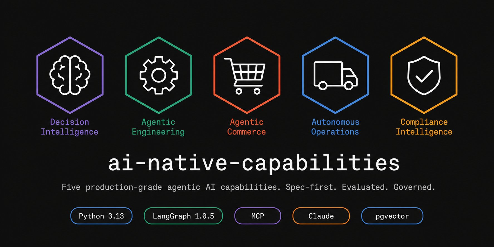
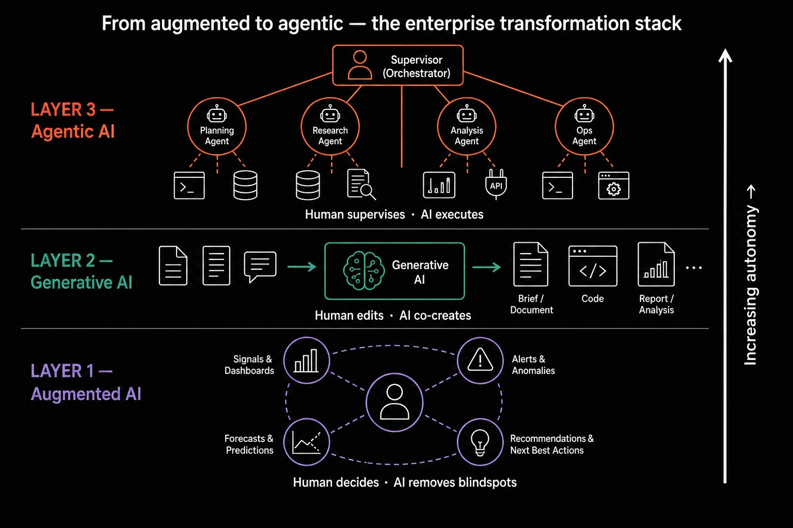
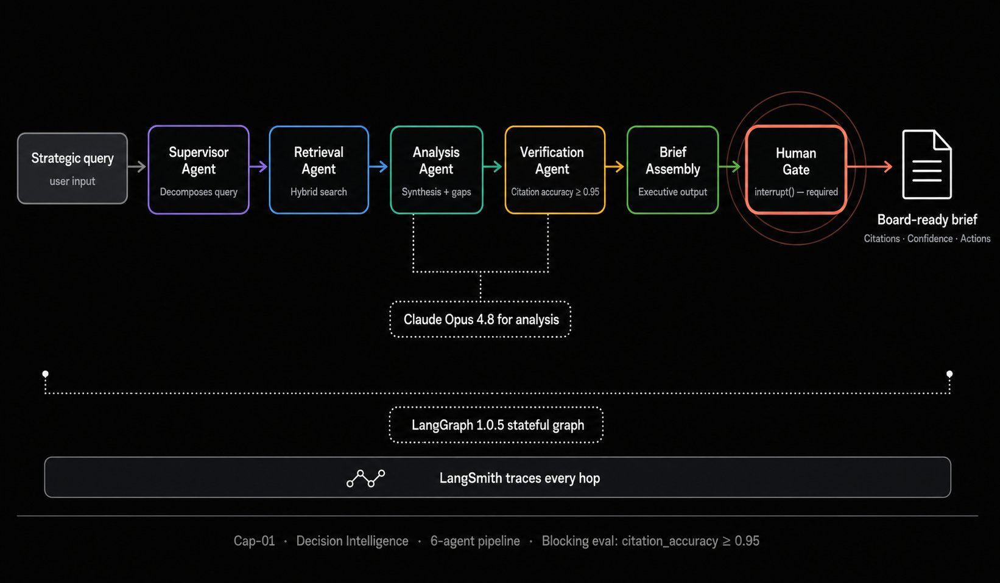
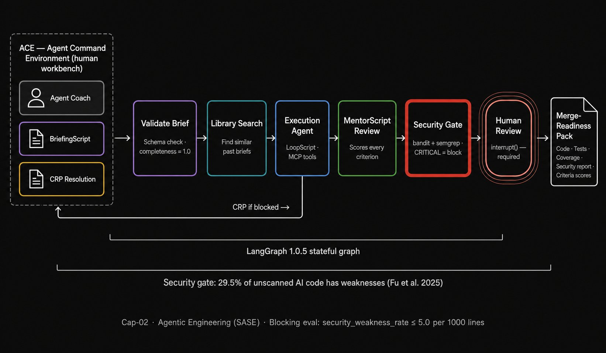
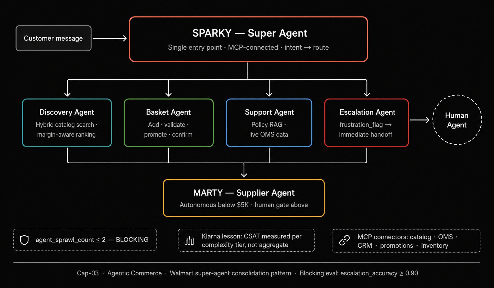
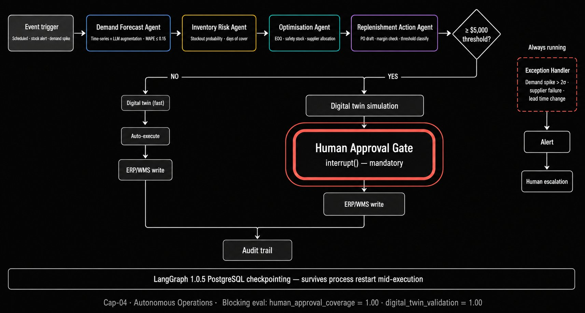
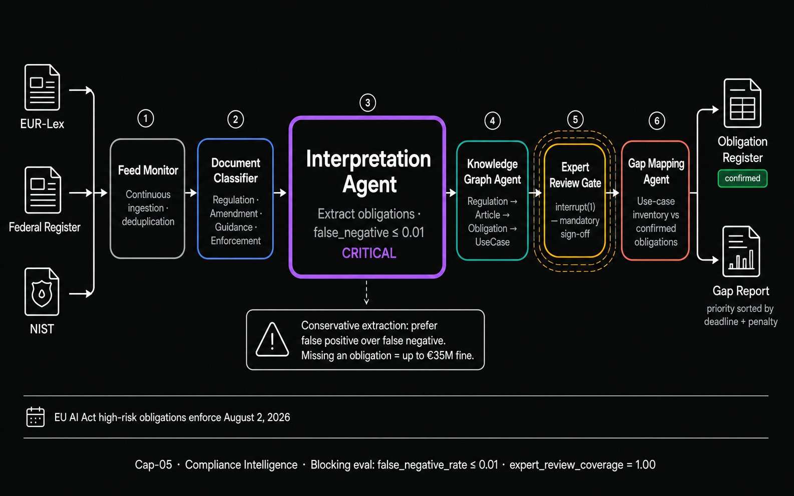
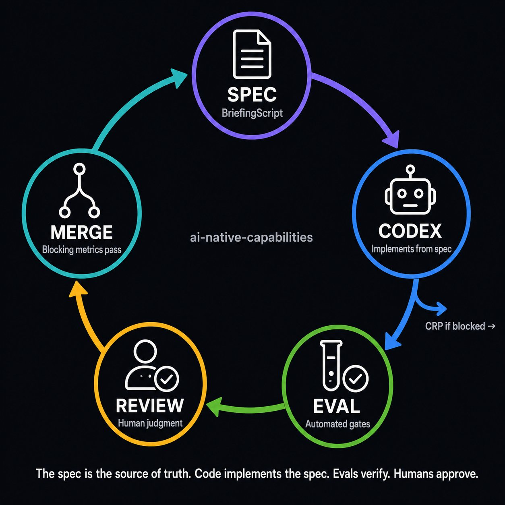
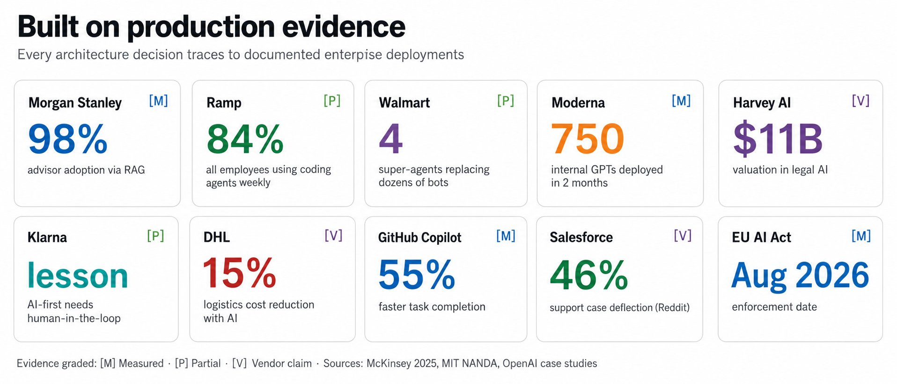

<div align="center">



<br/>

[](https://python.org)
[](https://langchain.com/langgraph)
[](https://modelcontextprotocol.io)
[](https://anthropic.com)
[](https://github.com/pgvector/pgvector)
[](https://opentelemetry.io)
[](https://github.com/rrodenas3/ai-native-capabilities/issues)
[](./LICENSE)

<br/>

### Five production-grade agentic AI capabilities.<br/>Built spec-first. Evaluated obsessively. Governed by design.

*Not a tutorial. A working reference implementation built to the engineering standards of the companies actually winning AI transformation — Walmart, Morgan Stanley, Ramp, Moderna, Harvey AI.*

<br/>

**[View Issues →](https://github.com/rrodenas3/ai-native-capabilities/issues)** &nbsp;·&nbsp; **[Read the Spec →](./cap-01-decision-intelligence/specs/SPEC.md)** &nbsp;·&nbsp; **[Start Building →](#quick-start)**

</div>

---

## The gap this closes

<div align="center">

| **88%** of orgs use AI | Only **39%** reach EBIT impact | **95%** of pilots fail P&L | **The gap is architecture** |
|:---:|:---:|:---:|:---:|
| McKinsey 2025, n=1,993 | McKinsey 2025 | MIT NANDA 2025 | Eval · Governance · Workflow redesign |

</div>

The constraint is not model capability. It is **architecture, evaluation, workflow redesign, and governance.** This project closes each one systematically, with every decision traced to production evidence.

---

## The three AI layers



Every capability is built across all three layers simultaneously. Augmented AI removes decision blindspots. Generative AI creates artifacts at scale. Agentic AI executes multi-step goals with human oversight. Most enterprise AI stalls at layer one — this project operates at all three.

---

## Cap-01 — Decision Intelligence



**Strategic query in. Cited, verified, board-ready brief out.**

Six agents in sequence. Every factual claim checked against its source by the Verification Agent before the Human Gate is reached. `citation_accuracy ≥ 0.95` is a blocking metric — the PR cannot merge without it.

**Reference:** Morgan Stanley — 98% advisor-team adoption, document access 20% → 80%, using the same RAG-with-forced-citations pattern. `[P]`

| Agent | Role | Model |
|---|---|---|
| Supervisor | Decomposes query into sub-tasks | `claude-sonnet-4-6` |
| Retrieval | Hybrid search (semantic + BM25 + metadata filter) | — |
| Analysis | Synthesis + contradiction + gap detection | `claude-opus-4-8` |
| Verification | Every claim checked against source — no exceptions | `claude-opus-4-8` |
| Brief Assembly | Executive summary + findings + citations + actions | `claude-sonnet-4-6` |
| Human Gate | `interrupt()` — unbypassable by design | — |

**Blocking evals:** `citation_accuracy ≥ 0.95` · `hallucination_rate ≤ 0.02` · [`SPEC →`](./cap-01-decision-intelligence/specs/SPEC.md)

---

## Cap-02 — Agentic Engineering (SASE)



**BriefingScript in. Merge-Readiness Pack out. Security gate on every file.**

Ramp achieved 84% of all employees — finance, marketing, ops — using coding agents weekly. The technical/non-technical boundary has dissolved. But unstructured agent use creates security risk: 29.5% of unscanned Copilot-generated Python contains weaknesses (Fu et al., ACM 2025). SASE provides the structure.

**Reference:** Ramp 99.5% active AI users + SASE paper (Hassan et al., ACM 2026). `[P]` + `[M]`

| Artifact | Owner | Purpose |
|---|---|---|
| BriefingScript | Human (Agent Coach) | Goal + acceptance criteria + Codex instructions |
| LoopScript | Execution Agent | Self-monitoring iteration plan |
| CRP | Execution Agent | Consultation when blocked — never guess |
| MentorScript | Review Agent | Scores every acceptance criterion — no exceptions |
| Merge-Readiness Pack | Execution Agent | The only artifact that reaches human review |

**Blocking evals:** `briefing_completeness = 1.0` · `security_weakness_rate ≤ 5.0 per 1000 lines` · [`SPEC →`](./cap-02-agentic-engineering/specs/SPEC.md)

---

## Cap-03 — Agentic Commerce



**Customer message in. Intent resolved, routed, handled, or escalated.**

Walmart's lesson from agent sprawl: dozens of narrow bots create governance chaos. The solution is consolidation — a single orchestrated super-agent (Sparky) routing to specialist sub-agents via MCP. The Klarna lesson is embedded: CSAT is measured per complexity tier, not aggregate. Frustrated customers trigger immediate human handoff — no retries.

**Reference:** Walmart super-agent consolidation (Sparky/Marty, 2025) · Lowe's Mylow 2× conversion. `[P]`

| Agent | Role | Critical constraint |
|---|---|---|
| Sparky | Single customer entry point — routes by intent | `agent_sprawl_count ≤ 2` BLOCKING |
| Discovery | Hybrid catalog search + ranking | Margin-negative items blocked from slot 1 |
| Basket | Add · validate · promote · confirm | Order confirmation required before OMS write |
| Support | Policy RAG + live OMS lookup | Never hallucinate order details — always fetch live |
| Escalation | Immediate human handoff | `frustration_flag` → no retries, no delay |
| Marty | Supplier / ops agent | Autonomous below $5K · human gate above |

**Blocking evals:** `agent_sprawl_count ≤ 2` · `escalation_accuracy ≥ 0.90` · [`SPEC →`](./cap-03-agentic-commerce/specs/SPEC.md)

---

## Cap-04 — Autonomous Operations



**Demand signal in. Approved, simulated, audited ERP write out.**

The most architecturally demanding capability. Supply chain tasks are long-running (hours to days), involve irreversible actions (purchase orders sent to suppliers), and require human approval above dollar thresholds. LangGraph's PostgreSQL durable execution is the architecture — not optional, not a preference.

**Reference:** Flowr arXiv 2604.05987 · Walmart self-healing inventory · DHL 15% logistics cost reduction · Deutsche Telekom RAN Guardian. `[M]` + `[P]`

The human approval gate is a LangGraph `interrupt()`. The graph physically cannot proceed past it without an explicit human decision. The digital twin runs before every action above the threshold. Both are blocking eval metrics at `= 1.00`.

**Blocking evals:** `human_approval_coverage = 1.00` · `digital_twin_validation = 1.00` · [`SPEC →`](./cap-04-autonomous-operations/specs/SPEC.md)

---

## Cap-05 — Compliance Intelligence



**Regulatory feed in. Confirmed obligations, gap report, audit trail out.**

Harvey AI reached $11B valuation and $190M ARR in this market. EU AI Act high-risk obligations enforce **August 2, 2026**. Fines reach **€35M or 7% of global turnover**. The critical design principle: a false negative on a regulatory obligation is potentially existential. Conservative extraction always — prefer false positives over false negatives.

**Reference:** Harvey AI $11B · A&O Shearman 2-3h/week saved per lawyer · EU AI Act enforcement Aug 2026. `[P]` + `[M]`

| Stage | Agent | Critical constraint |
|---|---|---|
| Monitor | Feed Monitor | EUR-Lex · Federal Register · NIST — continuous |
| Classify | Classifier Agent | REGULATION / AMENDMENT / GUIDANCE / ENFORCEMENT |
| Extract | **Interpretation Agent** | **`false_negative_rate ≤ 0.01` — the critical metric** |
| Map | Knowledge Graph Agent | Regulation → Article → Obligation → UseCase (Neo4j) |
| Review | Expert Gate | `interrupt()` — no obligation confirmed without sign-off |
| Gap | Gap Mapping Agent | Use-case inventory vs confirmed obligations |

**Blocking evals:** `false_negative_rate ≤ 0.01` · `citation_accuracy ≥ 0.98` · `expert_review_coverage = 1.00` · `query_answer_citation_rate = 1.00` · [`SPEC →`](./cap-05-compliance-intelligence/specs/SPEC.md)

---

## Spec-driven development



**The BriefingScript is the source of truth. Not the code.**

Every capability begins with a machine-readable `SPEC.md` before a single line of agent code is written. Codex and Claude Code implement from the spec. Evals verify against acceptance criteria. Blocking metrics prevent merge. Humans review output, not write it.

```
cap-XX/specs/SPEC.md
├── goal_and_why              # business value + evidence grade [M/P/V]
├── what_and_success          # acceptance criteria with measurable thresholds
├── all_needed_context        # agent graph · state schema · MCP connectors
├── implementation_tasks      # ordered tasks: TASK-XX-NN with dependencies
├── failure_modes             # what breaks + how it's mitigated + tests
├── eval_scorecard            # YAML blocking gates enforced in CI
└── codex_instructions        # machine-readable directives for the agent
```

Feed any issue directly to Codex — no copy-paste:
```bash
gh auth login
codex "$(gh issue view 10 --json title,body -q '.title + "\n\n" + .body')"
```

---

## Evidence base



Every architectural decision traces to documented production evidence. Evidence is graded:

- `[M]` **Measured** — independent, quantified, peer-reviewed or audited
- `[P]` **Partial** — company-reported, directionally credible
- `[V]` **Vendor claim** — directional only, treat with caution

Full library: [`docs/case-studies/`](./docs/case-studies/)

---

## Architecture principles

**Spec-first** — BriefingScript before code. Codex implements. Humans review output. The spec is the contract between human intent and agent execution.

**MCP-native** — all tool integrations via [Model Context Protocol](https://modelcontextprotocol.io) (spec 2025-11-25, Streamable HTTP + OAuth 2.1). No hardcoded wrappers. Every connector swappable.

**Eval on every PR** — common scorecard runs automatically. Blocking metrics prevent merge. The eval is the definition of done, not a post-launch check.

**Governance by design** — 5-gate engine (use-case → data → action → quality → scale) baked into `core/`. Human-in-the-loop via LangGraph `interrupt()` — not optional flags.

**In-context before orchestration** — arXiv 2604.27891: multi-agent orchestration only when the task genuinely requires state, tool routing, memory, approvals, or long-running execution. A well-prompted frontier model is the default.

---

## Stack

> Verified June 2026 + frontier research integration. Full detail: [`docs/architecture/STACK.md`](./docs/architecture/STACK.md)

```
Language         Python 3.13 · GIL-optional free-threaded · TypeScript for MCP servers
Orchestration    LangGraph 1.0.5 GA Oct 2025 · Uber · LinkedIn · JP Morgan · Blackrock
                 + core/harness/ — canonical loop · SSGM memory · sensor registry (ADR-002)
Protocol         MCP 2025-11-25 (→ 2026-07-28 stateless) · A2A v1.0 (Linux Foundation)
                 Cap-03: ACP/UCP commerce + AP2 payment mandates (ADR-003)
Models           claude-sonnet-4-6 (default) · claude-opus-4-8 (complex) · claude-haiku-4-5 (subagents)
                 gpt-5.5 / gpt-5 (judge models — must differ from agent family)
Memory           pgvector 0.7.x + pgvectorscale + Neo4j/FalkorDB (graph layer)
                 SSGM governed writes · A-MEM self-linking · A-MemGuard defense
Evals            LangSmith · Arize Phoenix OSS · Braintrust A/B+regression
                 CLEAR framework · Agent-as-a-Judge trajectory · 8 common metrics
                 ⚠ Cap-02: private-codebase evals only — SWE-bench Verified saturated
Observability    OpenTelemetry OTLP + OTEL GenAI gen_ai.* conventions (hop-level cost)
Security         bandit 1.8+ · semgrep 1.90+ · harness security eval · golden principles
CI               GitHub Actions · evals every PR · blocking metrics · cost delta · harness audit
```

---

## Quick start

```bash
git clone https://github.com/rrodenas3/ai-native-capabilities
cd ai-native-capabilities
python3.13 -m venv .venv && source .venv/bin/activate
pip install -e ".[dev]"
docker compose up -d
cp .env.example .env                     # add ANTHROPIC_API_KEY
python scripts/health_check.py
python scripts/run_evals.py --all --mock  # no API cost in mock mode
```

---

## Build order

```
Phase 1 — Core infrastructure        issues #1–#12  ← start here
  #10 Settings → #1 Base graph → #2 MCP → #11 DB → #12 Health check
  → #3 Governance → #4–6 Memory → #7 Evals → #8 Cost telemetry → #9 Schemas

Phase 2 — Cap-01 Decision Intelligence   issues #13–#27
Phase 3 — Cap-02 Agentic Engineering     issues #28–#52
Phase 4 — Cap-03 Agentic Commerce        issues #36–#53
Phase 5 — Cap-04 Autonomous Operations   issues #41–#45
Phase 6 — Cap-05 Compliance Intelligence issues #46–#49
```

Proficiency ladder for contributors: [L0 → L3](./docs/playbooks/RAMP_L0_L3.md)
Agent routing decisions: [When to use which model and pattern](./docs/architecture/AGENT_ROUTING.md)

---

## Repo structure

```
ai-native-capabilities/
├── core/                           # Shared infrastructure — build first
│   ├── orchestration/              # LangGraph base graphs + state schemas
│   ├── mcp/                        # MCP connector registry + base classes
│   ├── memory/                     # Episodic · semantic · procedural
│   ├── evals/                      # Common evaluation scorecard
│   ├── governance/                 # 5-gate approval engine + human gate
│   ├── observability/              # OTEL + cost telemetry
│   ├── schemas/base.py             # Canonical Pydantic models (all capabilities)
│   └── utils/                      # Settings · logging · retry · DB
│
├── cap-01-decision-intelligence/   # 6-agent RAG → board-ready brief
├── cap-02-agentic-engineering/     # SASE: BriefingScript → MRP → human review
├── cap-03-agentic-commerce/        # Sparky super-agent commerce mesh
├── cap-04-autonomous-operations/   # Stateful supply chain · durable · approval gates
├── cap-05-compliance-intelligence/ # Regulatory RAG + KG · EU AI Act · expert gate
│
├── docs/
│   ├── assets/                     # 9 visual assets (hero + 5 agent graphs + 3 diagrams)
│   ├── architecture/               # STACK.md · AGENT_ROUTING.md · MEMORY_ARCHITECTURE.md
│   ├── adr/                        # Architecture Decision Records
│   ├── playbooks/                  # RAMP_L0_L3.md · Shopify mandate · Moderna
│   └── case-studies/               # 40+ company evidence summaries
│
├── benchmarks/                     # Cross-capability comparison runs
├── scripts/                        # setup · health_check · run_evals · check_eval_gates
└── .github/workflows/evals.yml     # CI: eval suite on every PR
```

---

## Contributing

See [CONTRIBUTING.md](./CONTRIBUTING.md).

1. Read the spec for your capability: `cap-XX/specs/SPEC.md`
2. Open the issue: `gh issue view N`
3. Feed it to Codex: `codex "$(gh issue view N --json title,body -q '.title + "\n\n" + .body')"`
4. Check the acceptance criteria checkboxes
5. Run evals: `python scripts/run_evals.py --cap cap-XX`
6. Open PR → CI runs blocking metrics → merge closes the issue

Stuck? Raise a [Consultation Request](/.github/ISSUE_TEMPLATE/crp.md). Never guess.

---

## Roadmap

- [x] All 5 capability specs (BriefingScripts) — complete
- [x] Core: base orchestration graph, MCP registry, episodic memory — merged
- [x] 9 visual assets — hero banner, 5 agent graphs, 3 architecture diagrams
- [x] Frontier research integration — harness engineering, SSGM, protocols, evals
- [x] ADR-002 (harness engineering) + ADR-003 (protocol layering) — documented
- [x] core/harness/ scaffolded — canonical loop, SSGM memory, golden principles
- [ ] Core infrastructure complete (issues #4–#12 + new #13–#18)
- [ ] Cap-01 Decision Intelligence MVP (+ adaptive RAG, temporal RAG, A-MEM)
- [ ] Cap-02 Agentic Engineering MVP (+ private-codebase evals, SKILL.md library)
- [ ] Cap-03 Agentic Commerce MVP (+ A2A cards, ACP/UCP, AP2 mandates)
- [ ] Cap-04 Autonomous Operations MVP (+ self-healing loop, SSGM, Heartbeat)
- [ ] Cap-05 Compliance Intelligence MVP (+ GraphRAG, multi-judge, LAB benchmark)
- [ ] Benchmark dashboard — all 5 capabilities side-by-side (CLEAR framework)
- [ ] Interactive web demos per capability

---

<div align="center">

**Built by [Raul Rausell](https://github.com/rrodenas3)**

*AI-native transformation architect · Translating business problems into governed agentic systems, functional MVPs, and scalable operating models*

<br/>

*Grounded in: McKinsey State of AI 2025 · MIT NANDA GenAI Divide · SASE paper (Hassan et al., ACM 2026)*
*arXiv 2604.27891 · Flowr arXiv 2604.05987 · EU AI Act · Anthropic API docs June 2026*

<br/>

⭐ **If you find this useful, a star helps others discover it.**

[`github.com/rrodenas3/ai-native-capabilities`](https://github.com/rrodenas3/ai-native-capabilities)

</div>
