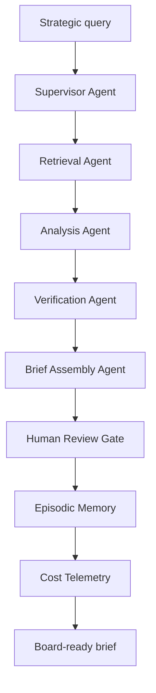

# Cap-01: Decision Intelligence

Transform scattered internal knowledge into cited, uncertainty-labelled, board-ready intelligence in real time.

**Reference case:** Morgan Stanley advisor assistant: high adoption through cited retrieval, eval-first release, and human accountability.
**AI layers:** Augmented -> Generative -> Agentic RAG
**Status:** implementation complete for Cap-01 baseline

## Quick Start

```bash
# From the repo root
$env:LLM_MODE="mock"
python cap-01-decision-intelligence/demo.py --query "What are our three biggest supply chain risks entering Q3?"

# Non-interactive smoke test
python cap-01-decision-intelligence/demo.py --query "What are our three biggest supply chain risks entering Q3?" --auto-approve

# Capability evals
python cap-01-decision-intelligence/evals/suite.py --output reports/cap01.json
python scripts/check_eval_gates.py reports/cap01.json --capability cap-01
```

The demo loads the committed 100-document synthetic corpus from `tests/fixtures/corpus`, retrieves relevant evidence, assembles a structured brief, pauses for human approval, records the decision, and prints cost/tokens for the run.

## Architecture



| Stage | Responsibility | Evidence Produced |
|---|---|---|
| Supervisor | Decompose query, set corpus scope, decide if web research is required | Sub-queries, routing audit event |
| Retrieval | Hybrid-search internal corpus with access-tier enforcement | Ranked `RetrievalResult` objects |
| Analysis | Synthesize themes, gaps, and contradictions | Analysis notes, evidence strength |
| Verification | Check claims against retrieved chunks | Citation accuracy, unverified flags |
| Brief Assembly | Build executive summary, findings, actions, confidence | `BriefOutput` with cited findings |
| Human Gate | Pause for accountable review before storage/action | Approval/rejection audit event |
| Episodic Memory | Store approved brief metadata for later learning | Memory event id |
| Cost Telemetry | Track tokens, latency, cost, and budget alerts per hop | `cost_telemetry`, OTEL spans |

## Eval Gates

| Metric | Target | Blocking |
|---|---:|---|
| Citation accuracy | >= 0.95 | Yes |
| Hallucination rate | <= 0.02 | Yes |
| Retrieval recall | >= 0.85 | No |
| Source coverage | >= 0.80 | No |
| Response latency p95 | <= 30s | No |
| Human override rate | <= 0.15 | No |
| Brief usefulness | >= 4.0 | No |
| Cost per brief | <= $0.50 | No |

Current fixture suite: 20 deterministic evaluation cases in `tests/fixtures/cap01_eval_cases.json`.

## Seed Corpus

The demo/test corpus is generated by:

```bash
python cap-01-decision-intelligence/tests/fixtures/generate_corpus.py --output cap-01-decision-intelligence/tests/fixtures/corpus --seed 42
```

It contains 100 Markdown documents across supply chain, finance, customer, AI governance, and market domains. Access tiers are balanced across `public`, `internal`, and `restricted`, and the first 10 documents include five deliberate contradiction pairs for verification and uncertainty tests.

## Demo Output

The CLI prints a compact board-ready brief:

```text
Cap-01 Board-Ready Brief
Summary      The evidence indicates that ...
Confidence   0.82
Cost         $0.00...
Tokens       ...
Human gate   approved
Finding 1    Evidence highlights ... [source title]
```

## Implementation Tasks

See [`specs/SPEC.md`](./specs/SPEC.md) for the complete BriefingScript.

| Task | Description | Status |
|---|---|---|
| TASK-01-01 | pgvector index + document ingestion | `done` |
| TASK-01-02 | Hybrid retrieval (semantic + BM25) | `done` |
| TASK-01-03 | Supervisor Agent | `done` |
| TASK-01-04 | Retrieval Agent | `done` |
| TASK-01-05 | Analysis & Synthesis Agent | `done` |
| TASK-01-06 | Verification Agent | `done` |
| TASK-01-07 | Brief Assembly Agent | `done` |
| TASK-01-08 | LangGraph state machine | `done` |
| TASK-01-09 | Episodic memory | `done` |
| TASK-01-10 | Human Review Gate + audit log | `done` |
| TASK-01-11 | Eval suite | `done` |
| TASK-01-12 | Cost telemetry | `done` |
| TASK-01-13 | CLI demo | `done` |
| TASK-01-14 | Seed corpus | `done` |
| TASK-01-15 | README | `done` |

## Evidence

| Source | Claim | Grade |
|---|---|---|
| Morgan Stanley case study | Advisor-facing AI succeeds when answers are source-backed and reviewed by accountable humans | P |
| Ramp Glass product pattern | Role-aware context and first-interaction value improve workflow adoption | P |
| McKinsey 2025 AI survey | Enterprise EBIT impact remains uneven, making eval gates and operational discipline material | M |

`M` = measured or independently supported. `P` = partial/company-reported. `V` = vendor claim.
