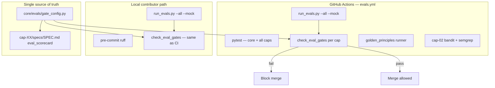

# feat: Close the enforcement gap — CI eval gates and harness completion

## Summary

This plan recommends **enforcement-first** as the single highest-leverage next step for `ai-native-capabilities`. The repo’s identity is “evaluated obsessively, governed by design,” but today all five capabilities pass mock evals locally (~1.0) while **no GitHub Actions workflow exists**, `core/harness/` is ~40% implemented, and gate logic is duplicated across three places that already drift. Phase 1 ships CI that actually blocks regressions; Phase 2 completes the harness layer ADR-002 defines; Phase 3 hardens eval suites so mock CI proves structure while a cost-capped `--real` tier proves behavior. Capability depth work (Cap-02 real execution, Cap-03 Basket/Marty, Cap-04 SSGM PO governance) follows — sequenced after enforcement, not instead of it.

---

## Problem Frame

**Portfolio state (June 2026):** Five capability specs are complete. Cap-01 is MVP-complete with demo and 62 tests. Caps 02–05 have deterministic baselines (189 pytest tests pass; `run_evals.py --all --mock` passes all blocking gates). Recent momentum on Cap-02 (ACE CLI, proficiency tool, eval suite) and Cap-05 (SSGMGovernor wiring) shows active development.

**The strategic gap:** The project sells **architecture, evaluation, and governance** as the reason 95% of AI pilots fail — yet the mechanisms that make those claims enforceable are mostly documentation:

| Claim | Reality |
|---|---|
| “Eval on every PR” | No `.github/workflows/` eval job |
| “Blocking metrics prevent merge” | Gates run only when invoked locally |
| “Agent = Model + Harness” (ADR-002) | `core/harness/` has `loop.py` + `memory.py` only |
| “Golden principles enforced” | Five `golden_principles.md` files, no CI runner |
| “Mock evals verify readiness” | Many blocking metrics are constants or mock-bypassed |

Mock eval scores near 1.0 across all caps create **false production readiness**. A contributor (or agent) can merge stub behavior that satisfies hardcoded metrics without exercising interrupt paths, security scanners, or inferential judges.

**Why enforcement beats capability depth right now:** Finishing Cap-03 Basket or Cap-02 real MCP execution adds visible features — but without CI and harness wiring, each new agent increases **unverified surface area**. Closing enforcement converts the existing 189 tests + five eval suites into a **contract the repo actually keeps**, and makes every subsequent capability investment measurable.

**Relationship to existing work:** `docs/plans/2026-06-17-001-feat-ssgm-cap04-po-governance-plan.md` remains valid and should land **after Phase 1 CI exists**, so SSGM quarantine metrics become merge-blocking rather than locally optional.

---

## Requirements

- R1: Every PR to `main` runs pytest and mock evals for all five capabilities in GitHub Actions
- R2: PR merge is blocked when any **blocking metric** fails or any MVP-complete cap lacks an eval report
- R3: Blocking metric thresholds have a **single source of truth** derived from cap `SPEC.md` eval_scorecards (no drift between suite and gate checker)
- R4: `run_evals.py` and `check_eval_gates.py` share one exit-code path — local “ready to merge” matches CI
- R5: Missing eval suite or eval error **fails** the aggregate run for caps marked MVP/baseline-complete in README roadmap
- R6: `core/harness/sensors.py` provides a sensor registry; `core/harness/golden_principles.py` runs blocking principles from each cap’s `golden_principles.md` in CI
- R7: Cap-02 CI job installs and runs **bandit + semgrep** — security gate cannot silently pass with zero findings when tools are absent
- R8: CI tier policy is documented: PR = mock-blocking for deterministic metrics; inferential metrics (hallucination, trajectory) scheduled or label-gated for `--real`
- R9: Cap-04 `human_approval_coverage` is computed from graph execution scenarios, not hardcoded `1.0`
- R10: After enforcement lands, Cap-04 SSGM PO plan (001) adds `ssgm_quarantine_coverage` to blocking gates

---

## Key Technical Decisions

**KTD-1: Enforcement-first sequencing.** Ship CI + gate unification before deepening any single cap. Rationale: multiplies value of all existing work; aligns repo behavior with README/CONTRIBUTING promises; lowest regret if paused — CI remains valuable indefinitely.

**KTD-2: Two-tier eval policy.** PR CI uses `--mock` (no API cost). Deterministic metrics block merge; inferential metrics (hallucination_rate, trajectory_success_rate) run on `workflow_dispatch` nightly or PR label `eval:real` with cost cap. Rationale: mock mode currently zeroes hallucination_rate in Cap-01 — acceptable for structural CI, unacceptable as sole proof of quality.

**KTD-3: Single gate config module.** Extract `BLOCKING_METRICS` from `scripts/check_eval_gates.py` into `core/evals/gate_config.py` (or parse SPEC YAML at runtime). Both `check_eval_gates.py` and cap suites import it. Rationale: SSGM metric already in Cap-04 suite but absent from gate checker — drift is active, not hypothetical.

**KTD-4: Fail-hard on missing reports.** Change `check_eval_gates.py` exit-0 on `no_eval_suite` / `error` to exit-1 for caps in `ENFORCED_CAPS` list (all five today). Rationale: soft-fail makes “enforcement closed” meaningless.

**KTD-5: Golden principles as Python runner.** Port shell `grep`-based GP tests to `golden_principles.py` for Linux CI portability. Keep markdown as source; runner parses `test:` blocks. Rationale: Windows dev + Linux CI mismatch; ADR-002 requires GP on every PR.

**KTD-6: Harness completion scope (Phase 2).** Minimum viable harness = `sensors.py` registry + `golden_principles.py` + `test_harness_security.py`. Full `AgenticLoop` executor (PLAN→ACT→OBSERVE→VERIFY→CORRECT) deferred to Phase 3 — types exist in `loop.py` but executor is not blocking for CI. Rationale: CI value ships faster; executor requires cap-by-cap wiring.

**KTD-7: Defer Cap-03 Basket/Marty and Cap-02 real MCP execution until Phase 4.** Rationale: user confirmed enforcement-first; these are highest functional gaps but add unverified code without gates.

---

## High-Level Technical Design

### Target enforcement architecture

### Phased roadmap

| Phase | Focus | Outcome | Depends on |
|---|---|---|---|
| **1** | CI + gate unification | PRs cannot merge on eval regression | — |
| **2** | Harness minimum viable | GP + sensors + harness security test in CI | Phase 1 |
| **3** | Eval suite hardening | No hardcoded blocking metrics; graph-driven cap-04 scenarios | Phase 1 |
| **4** | Capability depth | Cap-04 SSGM PO (plan 001), Cap-02 real execution, Cap-03 agents | Phases 1–3 |
| **5** | Real-LLM tier + benchmarks | Nightly `--real`, CLEAR dashboard, `docs/solutions/` | Phase 3 |

---

## Scope Boundaries

**In scope for this plan:**
- `.github/workflows/evals.yml` and supporting script changes
- Gate config unification
- `core/harness/sensors.py`, `golden_principles.py`, `test_harness_security.py`
- Cap-04 eval hardening (human_approval_coverage from graph)
- Documentation sync (README roadmap, CONTRIBUTING CI claims)

**Deferred to Follow-Up Work (after this plan):**
- Cap-04 SSGM PO governance implementation (existing plan 001 — execute in Phase 4)
- Cap-02 private-codebase eval set (20 real repo tasks)
- Cap-03 Basket and Marty agents
- Full `AgenticLoop` executor wiring in Cap-01/03
- `benchmarks/` CLEAR dashboard
- Interactive web demos per capability
- Braintrust regression baseline (TASK-CORE-18)

**Outside this product's identity:**
- Chasing SWE-bench Verified scores (saturated per STACK.md)
- Adding new capabilities beyond the five defined caps

---

## System-Wide Impact

| Stakeholder | Impact |
|---|---|
| **Contributors** | PRs may fail CI where they previously passed locally-only; `run_evals.py --all --mock` becomes mandatory pre-push habit |
| **Agent implementors (Codex/Claude)** | Spec blocking metrics become mechanically enforced — BriefingScript thresholds are real |
| **Downstream consumers** | Repo credibility increases — claims in README match CI behavior |
| **Operations** | Nightly `--real` evals need `ANTHROPIC_API_KEY` / `OPENAI_API_KEY` secrets and cost budget alerts |

---

## Risks & Dependencies

| Risk | Mitigation |
|---|---|
| CI green on mock but production quality unknown | Document two-tier policy (KTD-2); add nightly `--real` in Phase 5 |
| Gate config drift returns if SPEC YAML parsing is deferred | U2 must parse or codegen from SPEC; add test asserting gate_config matches each cap suite |
| First workflow push needs PAT `workflow` scope | Document in CONTRIBUTING; maintainer adds initial workflow |
| Cap-04 eval hardening breaks current 1.0 mock pass | Expected — fix graph scenarios before enabling strict gate |
| Harness executor deferred — caps still call tools directly | GP-03 enforcement + sensors registry as interim; full loop in Phase 5 |

**Dependencies:** GitHub repo with Actions enabled; `pip install -e ".[dev]"` in CI; bandit/semgrep available in CI image for Cap-02.

---

## Alternative Approaches Considered

**A: Capability-depth first (Cap-02 real execution)** — Ships visible SASE value faster. Rejected: adds agent output volume without scanners or CI gates; security gate already no-ops when bandit absent locally.

**B: Cap-03 Basket/Marty first** — Closes largest SPEC-vs-code functional gap. Rejected: new graph nodes without enforcement multiply untested paths; Sparky routing incomplete anyway.

**C: Benchmark dashboard first** — Impressive demo for portfolio. Rejected: dashboard visualizes mock ~1.0 scores — misleading until eval suites are honest.

**D: Documentation-only fix (update README to match reality)** — Low effort. Rejected: erodes project thesis; the gap is implementation, not messaging.

---

## Implementation Units

### U1. Add GitHub Actions eval workflow

**Goal:** Run pytest + mock evals + gate checks on every PR.

**Requirements:** R1, R2

**Dependencies:** None

**Files:**
- `.github/workflows/evals.yml` (create)
- `CONTRIBUTING.md` (update — PAT workflow scope note)

**Approach:** Parallel jobs: `test` (pytest with coverage optional), `evals` (matrix or sequential caps). Install deps via `pip install -e ".[dev]"`. Run `python scripts/run_evals.py --all --mock` then `check_eval_gates.py` per cap report at `reports/cap-XX.json`. Upload eval reports as artifacts. Post PR comment summary (optional follow-up).

**Patterns to follow:** STACK.md CI section; CONTRIBUTING merge flow

**Test scenarios:**
- CI workflow YAML validates (actionlint or manual review)
- Local reproduction: same commands as CI exit 0 on current main
- PR with intentionally failing cap-01 metric blocks merge (manual verification)

**Verification:** Workflow runs on test PR; all five cap reports generated; gate check invoked for each.

---

### U2. Unify gate configuration

**Goal:** Single source of truth for blocking metrics; eliminate drift.

**Requirements:** R3, R4, R5

**Dependencies:** None (can parallel with U1)

**Files:**
- `core/evals/gate_config.py` (create)
- `scripts/check_eval_gates.py` (refactor to import gate_config)
- `scripts/run_evals.py` (invoke check_eval_gates after each cap; fail on missing suite)
- `core/tests/test_gate_config.py` (create)

**Approach:** Move `BLOCKING_METRICS` dict to `gate_config.py`. Add `ENFORCED_CAPS` list. Export helper `check_report(report_path, cap_id) -> bool`. `run_evals.py` calls helper instead of inline threshold logic. Change soft-fail paths to hard-fail for enforced caps.

**Patterns to follow:** Existing `BLOCKING_METRICS` structure in `check_eval_gates.py`; thresholds from each cap `specs/SPEC.md` eval_scorecard

**Test scenarios:**
- Gate config includes all metrics from cap-01 through cap-05 SPECs
- Missing report for cap-01 returns failure (not exit 0)
- `no_eval_suite` status fails aggregate run
- `run_evals.py` exit code matches `check_eval_gates.py` for same report

**Verification:** `pytest core/tests/test_gate_config.py` passes; intentional drift test fails.

---

### U3. Implement golden principles CI runner

**Goal:** Enforce blocking golden principles from markdown on every PR.

**Requirements:** R6

**Dependencies:** U1 (CI job to host runner)

**Files:**
- `core/harness/golden_principles.py` (create)
- `core/harness/__init__.py` (export public API)
- `core/tests/test_golden_principles.py` (create)
- `.github/workflows/evals.yml` (add GP job step)

**Approach:** Parser reads each cap’s `golden_principles.md` for `test:` blocks with `severity: blocking`. Implement checks in Python (AST/grep equivalents) for: no hardcoded model strings, LLM calls logged, no direct tool invocation from model output paths. Non-blocking principles warn only.

**Patterns to follow:** Cap-02 `golden_principles.md` GP-01 through GP-05; ADR-002 harness section

**Test scenarios:**
- Runner discovers all five cap golden_principles files
- Inject violation (hardcoded `claude-sonnet-4-6` in test fixture) → runner fails
- Clean repo → runner passes
- Missing GP file for cap → warn vs fail per ENFORCED_CAPS policy

**Verification:** CI GP step passes on main; synthetic violation fails locally.

---

### U4. Add harness sensor registry

**Goal:** Provide `sensors.py` registry ADR-002 and core/SPEC.md promise.

**Requirements:** R6 (partial — registry only, not full loop)

**Dependencies:** U3 (shared harness package surface)

**Files:**
- `core/harness/sensors.py` (create)
- `core/harness/loop.py` (wire registry to existing sensor base classes)
- `core/tests/test_harness_sensors.py` (create)

**Approach:** `SensorRegistry` registers computational sensors by name; default sensors include schema validation and budget check stubs. Cap-02 `loop_runtime.py` registers security scan sensor hook point (no full executor yet).

**Patterns to follow:** `loop.py` `ComputationalSensor` / `InferentialSensor` types; `core/evals/metrics.py` sensor tier concept

**Test scenarios:**
- Register sensor → invoke → result recorded
- Unknown sensor name → explicit error (not silent pass)
- Registry serializes results for eval report extension (harness_security_score placeholder)

**Verification:** pytest passes; registry importable from `core.harness`.

---

### U5. Harden Cap-04 eval — graph-driven human approval

**Goal:** Replace hardcoded `human_approval_coverage: 1.0` with measured graph behavior.

**Requirements:** R9

**Dependencies:** U2 (unified gates)

**Files:**
- `cap-04-autonomous-operations/evals/suite.py` (modify)
- `cap-04-autonomous-operations/tests/test_cap04_operations.py` (reuse fixtures)

**Approach:** Eval suite runs three scripted scenarios against supply chain graph: (1) PO above threshold → interrupt raised, coverage counts pending; (2) resume with approval → ERP write proceeds, coverage = 1.0; (3) reject → no ERP write. Reuse checkpointer fixtures from existing pytest.

**Patterns to follow:** `test_graph_pauses_for_above_threshold_and_resumes` in cap-04 tests

**Test scenarios:**
- Above-threshold PO without approval → human_approval_coverage < 1.0
- Approved resume → coverage = 1.0
- Rejected PO → no ERP write, audit entry present
- Eval suite fails if coverage hardcoded

**Verification:** `run_evals.py --cap cap-04 --mock` passes with computed metrics; removing interrupt logic fails gate.

---

### U6. Cap-02 security scanners required in CI

**Goal:** Security gate cannot pass silently when bandit/semgrep absent.

**Requirements:** R7

**Dependencies:** U1

**Files:**
- `.github/workflows/evals.yml` (install bandit, semgrep)
- `cap-02-agentic-engineering/tools/security_gate.py` (fail loudly if tools missing when `EVAL_MODE=ci`)

**Approach:** CI installs `bandit` and `semgrep` via pip. Security gate checks `shutil.which` in CI mode and raises if absent. Run gate against `.cap02-security-scan/` or generated stub output.

**Patterns to follow:** Cap-02 SPEC security_weakness_rate blocking metric; existing vulnerable_samples fixtures

**Test scenarios:**
- CI mode + missing bandit → suite error (not pass)
- CI mode + bandit present + clean code → pass
- Known vulnerable sample → security_weakness_rate reflects findings

**Verification:** CI cap-02 job installs scanners; local without scanners warns in dev mode, fails in CI mode.

---

### U7. Document eval tier policy and sync README

**Goal:** Contributors and agents know what mock CI proves vs what requires `--real`.

**Requirements:** R8

**Dependencies:** U1, U2

**Files:**
- `docs/architecture/STACK.md` (eval tier section)
- `README.md` (roadmap checkboxes — mark CI complete when U1 lands)
- `CONTRIBUTING.md` (pre-push checklist: run_evals + gates)

**Approach:** Add “CI eval tiers” subsection: Tier 1 PR mock (deterministic), Tier 2 nightly real (inferential), Tier 3 manual deep eval. List which metrics belong to each tier per cap.

**Test scenarios:**
- Document lists all five caps with tier classification
- README roadmap item “evals every PR” checked only after U1 merged

**Verification:** Doc review — no contradiction between CONTRIBUTING and workflow behavior.

---

## Sources & Research

- Repo research analyst: portfolio maturity, 189 tests, missing CI, harness 40%, mock eval analysis
- Learnings researcher: ADR-001/002/003, CLEAR framework, L0→L3 ladder, SWE-bench saturation, output-only eval blind spot (~20% P0 misses)
- Spec flow analyzer: dual gate drift, soft-fail on missing suites, hardcoded cap-04 metrics, golden principles gap
- Existing plan: `docs/plans/2026-06-17-001-feat-ssgm-cap04-po-governance-plan.md` (sequenced Phase 4)
- Live verification: `python scripts/run_evals.py --all --mock` passes; `.github/workflows/` empty; `core/harness/` contains 2 files

---

## Recommended Next Step (Executive Summary)

**Do U1 + U2 immediately** — add `.github/workflows/evals.yml` and unify gate configuration. This is the smallest work that closes the largest credibility gap between project thesis and repo behavior. Everything else in this plan (harness, eval hardening, capability depth) becomes safer and measurable once CI enforces the contract.

After U1/U2 merge, execute **U3–U6** in parallel where possible, then proceed to **Cap-04 SSGM plan 001** with `ssgm_quarantine_coverage` added to blocking gates (R10).
